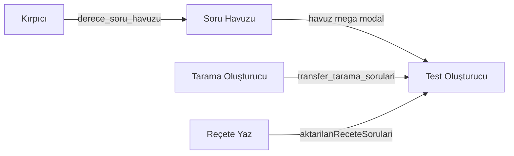

# Test Maker — ESKİ Derecepanel parity

Kaynak arşiv: `ESKİ DERECEPANEL/Derecepanel21/` (HTML + JS). Belirsizlikte **ESKİ kazanır**.

## Modül diyagramı

## Rotalar

| Sayfa | Route |
|--------|--------|
| Yönlendirme | `/dashboard/test-maker` → `/dashboard/test-maker/olusturucu` |
| Test Oluşturucu | `/dashboard/test-maker/olusturucu` |
| Otomatik Soru Kırpıcı | `/dashboard/test-maker/kirpici` |
| Soru Havuzu | `/dashboard/test-maker/havuz` |

## Depolama

| Anahtar | Kullanım |
|---------|----------|
| `derece_soru_havuzu` | Soru havuzu (localStorage MVP) |
| `derece_hatali_soru_havuzu` | Hata Reçetesi (ayrı modül) |
| `transfer_tarama_sorulari` | Tarama → Test (tek kullanım) |
| `aktarilanReceteSorulari` | Reçete → Test |
| IndexedDB `derece_tarama_deposu` | Tarama arşivi |

API: `GET/POST /api/question-pool`, `PATCH/DELETE /api/question-pool/[uuid]` — sunucu belleği (demo); üretimde Prisma + R2/S3.

## Müfredat

Tek kaynak: `data/yks-mufredat.json` → `@/lib/mufredat`, uyumluluk: `@/lib/yks-mufredat`.

Havuz kayıtları **ders/konu/kavram isim** saklar; filtre `data-name` ile eşleşir.

## Parity notları

- Kırpıcı: pixel tabanlı `auto-scan-engine.ts` (ESKİ `findQuestionBoxesByPixels` portu).
- Test kaydı: `getAllQuestionItems()` — tüm sayfalar (ESKİ ilk sayfa hatası düzeltildi).
- Tarama Oluşturucu / Reçete transfer anahtarları: `lib/test-maker/transfers.ts` + `intake.ts`.
