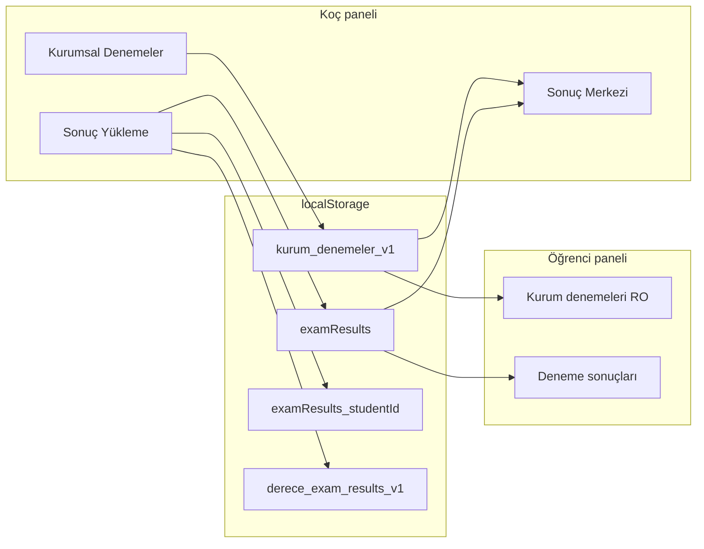

# Denemeler veri akışı

Bu belge, ESKİ Derecepanel21 ile uyumlu localStorage sözleşmesinin yeni Next.js projesindeki karşılığını özetler.

## Depolama anahtarları (değiştirilmez)

| Anahtar | İçerik |
|---------|--------|
| `kurum_denemeler_v1` | Kurumsal deneme tanımları (matris, cevap anahtarı) |
| `global_denemeler_v1` | Global takvim (okuma / merge) |
| `examResults` | Kanonik sonuç havuzu |
| `examResults_{studentId}` | Öğrenci arşivi (max 120) |
| `derece_exam_results_v1` | Yükleme paket geçmişi (max 50) |
| `derecepanel_optik_templates_v1` | Optik şablon yedek (LS) |
| `derecepanel_student_catalog_v1` | Legacy öğrenci kataloğu |

Yeni proje ayrıca `students_full_v1` kullanır; yükleme ekranı her iki kaynağı birleştirir.

## Akış diyagramı

## Kod modülleri

| Modül | Dosya |
|-------|--------|
| Layout TYT/AYT/YDT | `lib/exams/exam-layout.ts` |
| Kurum CRUD / merge | `lib/exams/exam-storage.ts` |
| Sonuç yazma | `lib/exams/exam-results-storage.ts` |
| Net hesabı | `lib/exams/exam-evaluate.ts` |
| Sıralama | `lib/exams/exam-rank.ts` |
| TXT parse | `lib/exams/exam-parser.ts` |
| Optik şablon | `lib/exams/fmt-store.ts` |
| Karne PDF | `lib/exams/karne.ts` |

## Olaylar

- `examResults:change` — yükleme veya sonuç güncellemesi sonrası (Analiz Merkezi ile uyumlu)
- `storage` — `kurum_denemeler_v1`, `examResults` dinlenir

## Rotalar

- `/dashboard/denemeler/kurumsal`
- `/dashboard/denemeler/yukleme`
- `/dashboard/denemeler/sonuc-merkezi`
- `/ogrenci/kurum-denemeler`
- `/ogrenci/deneme-sonuclari`
